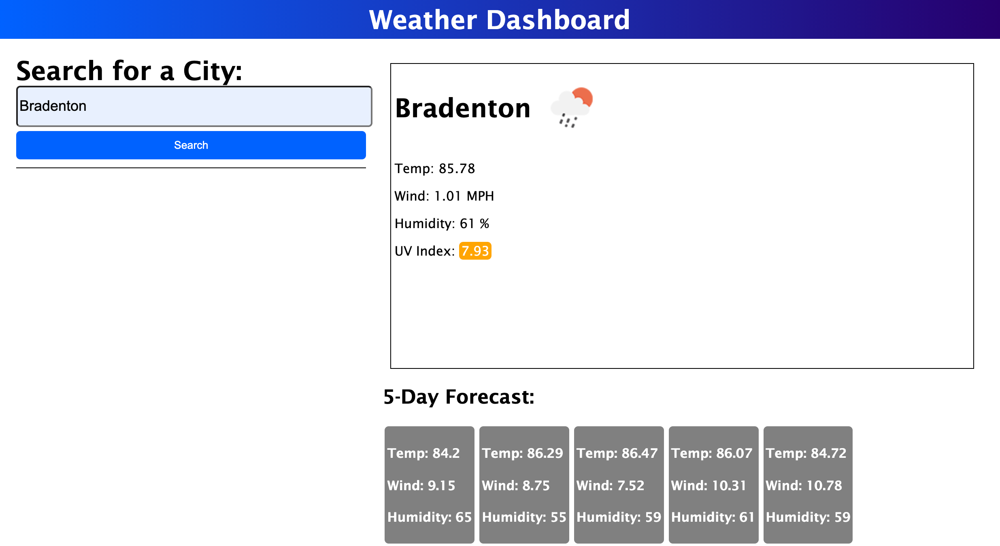

# Weather Dashboard
Utilizing the OpenWeather API, a user can enter a city name and see the weather forecast up to five days in advance for that particular city. 

### Resources
*HTML
*CSS
*JavaScript
*OpenWeather API

https://cah4758.github.io/weather-dashboard/ [Deployed App Link

